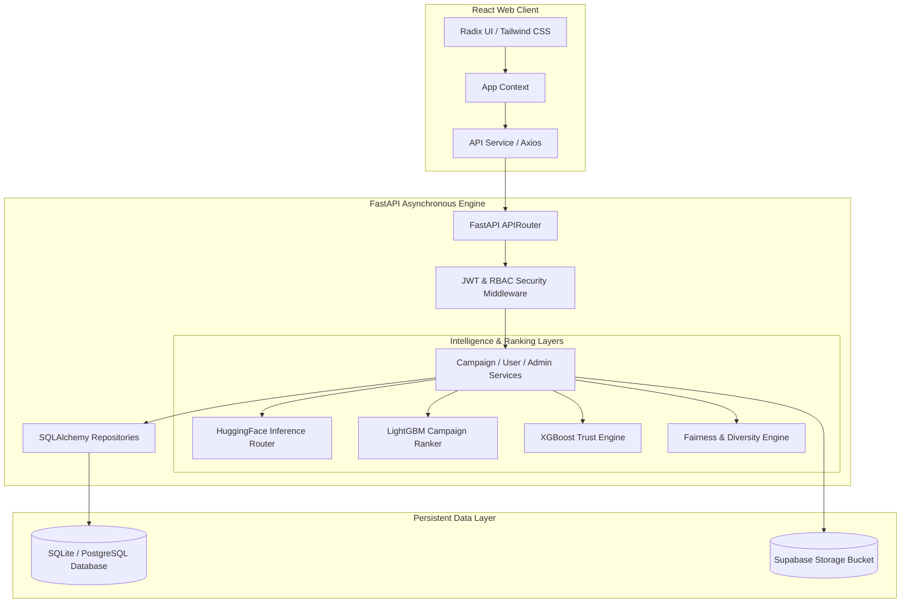
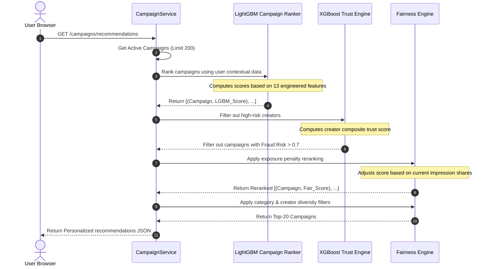

# EmpathI: AI-Powered Humanitarian Crowdfunding Platform

[](https://fastapi.tiangolo.com)
[](https://react.dev)
[](https://github.com/microsoft/LightGBM)
[](https://xgboost.readthedocs.io)
[](https://huggingface.co)

**EmpathI** is a state-of-the-art, intelligence-driven crowdfunding and emergency fundraising platform designed to maximize the impact of community support. By combining modern AI models, robust Trust scoring (XGBoost), and a Fairness Engine, EmpathI guarantees that high-priority campaigns gain high visibility, fraud is actively prevented, and donors enjoy a highly transparent and secure giving experience.

---

## Table of Contents

1. [Project Overview](#project-overview)
2. [Technical Architecture](#technical-architecture)
3. [Implemented Core Features](#implemented-core-features)
4. [ML & AI Recommendation Pipeline](#ml--ai-recommendation-pipeline)
5. [NLP & Multi-Modal Integrations](#nlp--multi-modal-integrations)
6. [Project Structure](#project-structure)
7. [API Documentation](#api-documentation)
8. [Installation & Setup](#installation--setup)
9. [Recent Updates](#recent-updates)
10. [Limitations, Fallbacks & Rationale](#limitations-fallbacks--rationale)

---

## Project Overview

In traditional crowdfunding, viral campaigns capture 90%+ of donations while critical, localized emergency campaigns get buried. **EmpathI** solves this "monopoly of attention" problem through:
* **AI-Assisted Moderation**: NLP analysis extraction, urgency levels, OCR documents verification, toxicity checks.
* **Intelligent Personalization**: Learn donor behaviors to recommend campaigns matching category preferences and local city proximity.
* **Trust & Security Foundation**: Creator reputation profile computed via XGBoost classifiers to flag fraud and gauge fulfillment probabilities.
* **Fairness-Aware Attention Allocation**: Dynamic exposure reranking that ensures new, niche, and high-urgency fundraisers gain fair visibility.

---

## Technical Architecture

EmpathI is built using a highly decoupled, monolithic backend-frontend architecture utilizing modern frameworks:



### Backend Framework
* **FastAPI (Python 3.10+)**: Fully asynchronous endpoints, automatic OpenAPI documentation, Pydantic V2 schemas validation.
* **SQLAlchemy ORM**: Flexible database mappings, decoupled repository layer.
* **Alembic**: Strict schema migrations tracking.
* **APSRunner / FastAPI BackgroundTasks**: Asynchronous offloading for analytics computation and recommendations caching.

### Frontend Web App
* **React 18 & Vite**: Lightning-fast builds, modular page organization, responsive masonry grid components.
* **Framer Motion**: Premium, smooth micro-animations.
* **radix-ui & Tailwind CSS**: Harmonious color palettes and accessible UI systems.

---

## Implemented Core Features

EmpathI features are fully implemented and verified via end-to-end integration test suites:

### 1. Unified Authentication & Role-Based Access Control (RBAC)
* Secure JWT session handling (7-day persistence).
* User Roles:
  * **USER**: General public role. Can browse recommendations, save campaigns, follow creators, make donations, post comments/likes.
  * **CREATOR**: Privileged campaign creator role. Can launch, edit, and close campaigns, post updates, track analytics.
  * **ADMIN**: Platform admin. Campaign verification, spam/toxicity moderation, users database overrides.

### 2. Interactive Campaign System
* **Masonry Discovery Feed**: Pinterest-style responsive campaign feed with categories filtering.
* **Live Campaigns Updates**: Creators can post pinned announcements (medical receipts, bills) with supporting images. Donors can like and comment.
* **Saves & Timelines**: Users can bookmark campaigns to save to their personalized dashboard.

### 3. Trust-Focused Crowdfunding & Donating
* **Direct UPI/Card Simulation**: Seamless donation logs mapped directly to campaigns.
* **Anonymous Donations**: Allow donors to hide their identities/cities from public timelines.
* **Automatic Milestones**: Campaigns are automatically closed as `COMPLETED` when fundraising goals are met.

### 4. Admin Management Dashboard
* Fully featured dashboards for platform-wide metrics: user count, campaign velocity, active categories ratios.
* Document Verification: Review OCR outputs and manually toggle verification statuses.

---

## ML & AI Recommendation Pipeline

When a user requests their recommendation feed, EmpathI runs a multi-staged AI pipeline:



### Stage 1: LightGBM Discovery Ranker (`ml/campaign_ranker.py`)
Predicts campaign success likelihood using **13 engineered features**:
* **Campaign Features**: Days active, goal amount, raised percentage.
* **Engagement Metrics**: Total donor count, average donation size, recent donation count (7 days), momentum (recent vs older donation velocity).
* **AI Metadata**: Text toxicity score, category classification confidence.
* **Personalization**: User category match, user city proximity relevance.
* **Model Design**: LightGBM binary classifier trained to identify campaigns reaching 80%+ of goal targets. Fallbacks to heuristic momentum scoring if the pre-trained `pkl` file is unavailable.

### Stage 2: XGBoost Trust Engine (`services/trust_engine.py`)
Computes a creator composite score (0.0 to 1.0) based on three factors:
1. **Fulfillment Probability (50% weight)**: Past campaign completion rate, post-completion progress update frequency, profile age.
2. **Fraud Risk Score (30% weight)**: XGBoost binary classifier evaluating goal variances, rapid creation velocities, suspicious email domain patterns (disposable hosts). Campaigns with a fraud risk $> 0.7$ are immediately flagged and excluded from feeds.
3. **Dispute Probability (20% weight)**: Profile age analysis (new creators carry higher risk).

### Stage 3: Fairness & Impression-Aware Allocation (`services/fairness_engine.py`)
To prevent the "winner-takes-all" effect where viral campaigns dominate the homepage:
* **Impression Balancing**: Tracks campaign views logs per user.
* **Penalty Calculation**: Gradually penalizes campaigns accumulating too high a share of system impressions.
* **Diversity Constraints**: Filters recommendations to return a maximum of 3 campaigns from the same category and 2 from the same creator in a single view.

---

## NLP & Multi-Modal Integrations

EmpathI utilizes state-of-the-art HuggingFace Transformers and PaddleOCR pipelines to automate campaign auditing:

| Engine | Model ID / Engine | Purpose | Current Implementation & Fallback |
| :--- | :--- | :--- | :--- |
| **Semantic Embeddings** | `BAAI/bge-small-en-v1.5` | 384-dimensional campaign description embeddings | Generates vector embeddings for semantic duplicates checking. Default fallback to 384-d zero array. |
| **Campaign Analysis** | `Qwen/Qwen2.5-1.5B-Instruct` | Coherent description auditing and extraction | Analyzes title & body text via HF Chat Completions. Extracts goal values, validates categories, and infers urgency. Falls back to medium urgency structural template. |
| **Summarization** | `sshleifer/distilbart-cnn-12-6` | Brief overview creation for card thumbnails | DistillBART CNN text summarization. Falls back to descriptive slice template. |
| **Toxicity Moderation** | `unitary/toxic-bert` | Abuse and spam detection | Scans texts for toxicity/spam flags during campaign creation. Falls back to 0.0 safe rating. |
| **OCR Document Extraction** | `PaddleOCR` (Local Engine) | Auditing hospital bills and ID documents | Predicts text inside verification images. Safe wrapper catches system issues (like Paddle runtime mismatches) and yields logs with empty string fallback. |
| **Image Captioning** | `Salesforce/blip-image-captioning-base` | Image context verification | Local BLIP captioner parses campaign cover images to ensure they match fundraising categories (e.g. medical ward vs gaming setup). |

---

## Project Structure

Below is the verified layout of the active files in the EmpathI repository:

```text
EmpathI/
├── backend/
│   ├── alembic/                       # Database migrations timeline
│   ├── api/                           # Endpoint routing layer
│   │   ├── deps.py                    # JWT decoding and RBAC dependencies
│   │   └── v1/
│   │       ├── endpoints/
│   │       │   ├── admin.py           # Admin statistics & overrides
│   │       │   ├── auth.py            # User registration & JWT login
│   │       │   ├── campaigns.py       # Campaigns CRUD & AI analysis
│   │       │   └── users.py           # Profiles & user activity timelines
│   │       └── router.py              # Consolidated v1 routes registry
│   ├── core/
│   │   ├── exceptions.py              # Custom HTTP and Auth exceptions
│   │   └── security.py                # BCrypt password hashing & JWT generators
│   ├── ml/
│   │   ├── campaign_ranker.py         # LightGBM campaign ranking model
│   │   └── hf_services.py             # HuggingFace & PaddleOCR core modules
│   ├── repositories/                  # Clean database interface queries
│   │   ├── campaign_repo.py
│   │   ├── donation_repo.py
│   │   └── user_repo.py
│   ├── services/                      # Consolidated business logic services
│   │   ├── admin_service.py
│   │   ├── audit_service.py
│   │   ├── auth_service.py
│   │   ├── campaign_service.py        # Core campaigns orchestrator & recommendation pipeline
│   │   ├── fairness_engine.py         # Impression balancing & diversity filters
│   │   ├── storage_service.py         # Supabase file uploads handler
│   │   └── trust_engine.py            # XGBoost fraud risk & composite trust calculations
│   ├── seed/                          # Realistic datasets generation
│   │   ├── generate_data.py
│   │   ├── schema.sql
│   │   ├── seed_sqlite.py
│   │   └── validators.py
│   ├── config.py                      # Asynchronous pydantic configuration settings
│   ├── database.py                    # SQLAlchemy session makers
│   ├── main.py                        # FastAPI startup and CORS configurations
│   ├── models.py                      # Unified SQLAlchemy models mappings
│   ├── requirements.txt               # Backend dependencies list
│   └── schemas.py                     # Strong Pydantic request/response models
├── frontend/
│   ├── public/                        # Static assets folder
│   ├── src/
│   │   ├── assets/                    # Shared image resources
│   │   ├── components/                # Reusable UI widgets
│   │   │   ├── ui/                    # Base visual tokens (Buttons, Cards, Inputs)
│   │   │   ├── CampaignCard.jsx       # Card component for discover feeds
│   │   │   ├── DonationModal.jsx      # Simulation payments modal
│   │   │   └── ProgressBar.jsx        # Visual progress tracker
│   │   ├── context/                   # Context states (App state, Auth state)
│   │   ├── layouts/                   # Shared wrapper structures (Public, Dashboard)
│   │   ├── pages/                     # Routed views (Landing, login, feeds, dashboards)
│   │   ├── services/                  # API communication layer
│   │   ├── App.jsx                    # React Router definitions (14 clean routes)
│   │   ├── index.css                  # Vanilla CSS variables & styling tokens
│   │   └── main.jsx                   # React root launcher
│   ├── package.json                   # Frontend dependencies
│   └── vite.config.js                 # Vite compiler configurations
├── .env.example                       # Application environment variables setup template
```

---

## API Documentation

EmpathI enforces stateless JWT bearer tokens for role-based endpoints.

### Authentication Endpoints (`/auth`)

| Method | Path | Required Role | Description | Request Payload | Response Schema |
| :--- | :--- | :--- | :--- | :--- | :--- |
| `POST` | `/auth/register` | Public | Registers a new account. Standard default role: `USER`. | `UserCreate` (email, password, name, role, city) | `UserResponse` (JSON with user meta) |
| `POST` | `/auth/login` | Public | Authenticates credentials and returns a secure JWT. | URL Encoded Form (`username`, `password`) | `{ "access_token": "...", "token_type": "bearer" }` |
| `GET` | `/auth/me` | Logged In | Retrieves current user session object. | None | `UserResponse` |
| `PUT` | `/auth/profile` | Logged In | Updates user bio, phone, or location. | `UserUpdate` (optional fields) | `UserResponse` |

### Campaign Endpoints (`/campaigns`)

| Method | Path | Required Role | Description | Request Payload | Response Schema |
| :--- | :--- | :--- | :--- | :--- | :--- |
| `POST` | `/campaigns` | CREATOR / ADMIN | Launches a new campaign. Automates NLP summarization & classification. | `CampaignCreate` | `CampaignResponse` |
| `POST` | `/campaigns/analyze` | USER / CREATOR | AI Pre-check: Inferred urgency & categories from text description. | `{ "title": "...", "description": "..." }` | `{ "suggestions": "...", "predicted_category": "...", "inferred_urgency": "..." }` |
| `GET` | `/campaigns` | Public | Lists all active and completed campaigns. Supports city & category queries. | Query Params: `skip`, `limit`, `city`, `category` | `List[CampaignResponse]` |
| `GET` | `/campaigns/taxonomy` | Public | Returns valid category trees, verification needs, and AI audit policies. | None | `List[CampaignCategoryResponse]` |
| `GET` | `/campaigns/recommendations` | Logged In | Generates dynamic LightGBM personalized feeds with XGBoost filtering. | None | `List[CampaignRecommendation]` |
| `POST` | `/campaigns/{id}/donate` | Logged In | Simulates a transaction. Updates the progress bar in real-time. | Query Param: `amount` | `DonationResponse` |
| `POST` | `/campaigns/{id}/updates` | CREATOR (Owner) | Posts progress updates (medical receipts, announcements). | `CampaignUpdateCreate` | `CampaignUpdateResponse` |
| `POST` | `/campaigns/{id}/updates/{uid}/like` | Logged In | Likes a campaign progress update announcement. | None | `{ "message": "Liked update" }` |

---

## Installation & Setup

Follow these steps to set up and run EmpathI in a local environment:

### Prerequisite System Packages
Ensure the following system libraries are installed on your machine:
* **Python**: Version 3.10 or 3.11.
* **Node.js**: Version 18 or 20 (with NPM).
* **Poppler** (Required for PDF conversion inside document processing):
  * **Windows**: Download binaries via [poppler-windows](https://github.com/oschwartz10612/poppler-windows/releases) and add the `bin/` path to your system's environment variables.
  * **macOS**: `brew install poppler`
  * **Ubuntu/Debian**: `sudo apt-get install poppler-utils`

---

### 1. Backend Setup

First, clone and enter the backend workspace directory:
```bash
cd backend
```

Create a python virtual environment and activate it:
```bash
# Windows PowerShell
python -m venv .venv
.\.venv\Scripts\Activate.ps1

# macOS/Linux
python -m venv .venv
source .venv/bin/activate
```

Install python backend dependencies:
```bash
pip install -r requirements.txt
```

Set up your `.env` configuration file:
```bash
copy .env.example .env  # Windows
cp .env.example .env    # macOS/Linux
```
Modify `.env` to supply your **HuggingFace API Key (Token)** and your database configuration:
```env
HUGGINGFACE_API_KEY=your_hf_token_here
DATABASE_URL=sqlite:///empathi.db
```

Seed the database with sample campaigns and taxonomy structures:
```bash
python seed_db.py --scale small
```

Start the FastAPI development server:
```bash
uvicorn main:app --reload
```
The interactive Swagger API documentation is now accessible at `http://localhost:8000/docs`.

---

### 2. Frontend Setup

In a new terminal window, enter the frontend directory:
```bash
cd frontend
```

Install frontend Node dependencies:
```bash
npm install
```

Ensure your unified `.env` file at the **project root** has the required frontend variables configured (starting with `VITE_` e.g. `VITE_API_BASE_URL` and `VITE_APP_NAME`). Vite is configured to load this root `.env` file directly. No separate `.env` or `.env.local` files are needed inside the `frontend/` directory!


Start the local React development compiler:
```bash
npm run dev
```
Open `http://localhost:5173` in your browser to view the application.

---
## Recent Updates

### UI/UX Improvements (Latest Release)
* **Favicon Update**: Changed favicon from generic Vite icon to custom EmpathI logo (`logo.png`) for better brand recognition.
* **Logo Branding Enhancement**: Replaced placeholder Activity icons with the actual EmpathI logo image throughout the UI, maintaining proper aspect ratio and responsiveness:
  - Public header navigation
  - Dashboard sidebar (responsive sizing)
  - Mobile menu header
  - Login page branding
  - Footer branding
* **Navigation Improvements**: All logo/branding elements are now clickable links that redirect to the landing page (`/`), improving navigation flow.

### Feature Removals
* **Settings Tab Removed**: The user Settings page and all associated features have been completely removed:
  - Security & Access settings (password, 2FA)
  - Proximity Alerts configuration
  - Preferences (theme, language, default landing)
  - Developer API management
  - **Note**: Profile updates through the main profile page remain fully functional for legitimate user data modifications (name, email, address, bio, etc.).

---
## Limitations, Fallbacks & Rationale

Honest assessments of engineering compromises made in the EmpathI architecture:

### 1. SQLite for Local Development vs. Production PostgreSQL
* **Why Chosen**: SQLite keeps setup frictionless by removing the overhead of managing a local Postgres container.
* **Limitations**: Concurrency limitations under high traffic write-volumes. 
* **Fallback Design**: The connection pooling logic in `database.py` dynamically handles multi-threading locks by setting custom timeout arguments, allowing seamless transition to PostgreSQL (using Neon/Supabase Poolers) simply by modifying the `DATABASE_URL` environment string.

### 2. Hugging Face Inference API Timeout Resilience
* **Why Chosen**: The HuggingFace Inference API router avoids running large Transformers (like 1.5B LLMs or zero-shot classification structures) locally, which would require massive GPU hardware and memory resources.
* **Limitations**: Public endpoint calls can experience latency fluctuations or rate-limiting timeouts under load.
* **Fallback Design**: Every single AI helper class inside `ml/hf_services.py` wraps calls in strong try-except exception handlers. If a timeout occurs, the system falls back instantly to safe local heuristics:
  * **Classification**: Defaults to "community aid" tags.
  * **Toxicity**: Safely assumes 0.0 (clean content) to avoid blocking campaign creations.
  * **LLM Extraction**: Falls back to user-provided form fields.

### 3. PaddleOCR vs. TrOCR Integration Tradeoffs
* **Why Chosen**: PaddleOCR was selected over TrOCR due to its high efficiency on CPU architectures and excellent multi-lingual (specifically Indic character sets) layout parsers.
* **Limitations**: PaddleOCR introduces complex compiled system dependencies. Mismatched binaries on different architectures can occasionally throw Pirate framework conversion attributes errors.
* **Fallback Design**: The `extract_document_text` function isolates PaddleOCR inside a dedicated try-catch container. If an internal engine error is thrown, it captures the trace, logs a warning, and safely returns an empty string to ensure the campaign submission process continues smoothly.

---

**EmpathI Crowdfunding Platform** — Empowering community support through transparent, fair, and trust-focused AI.  
*Last updated: May 2026 (UI/UX improvements & Settings feature removal)*
